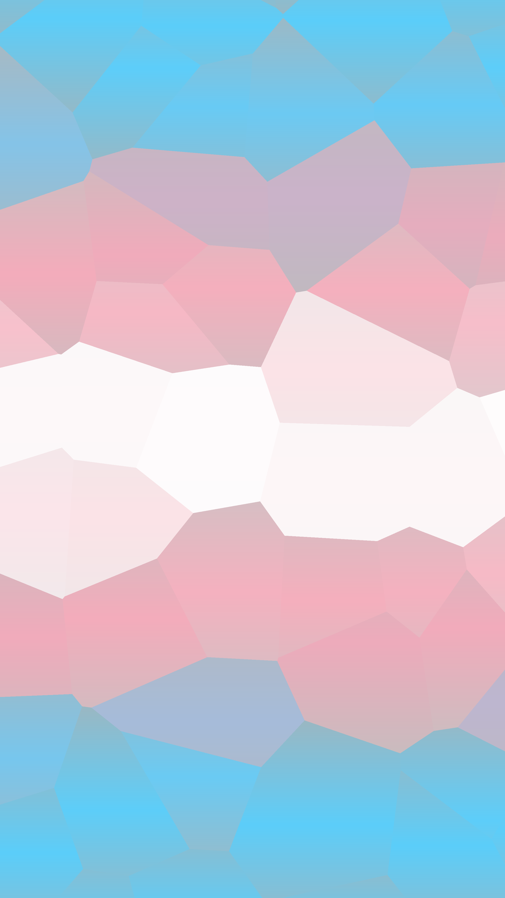
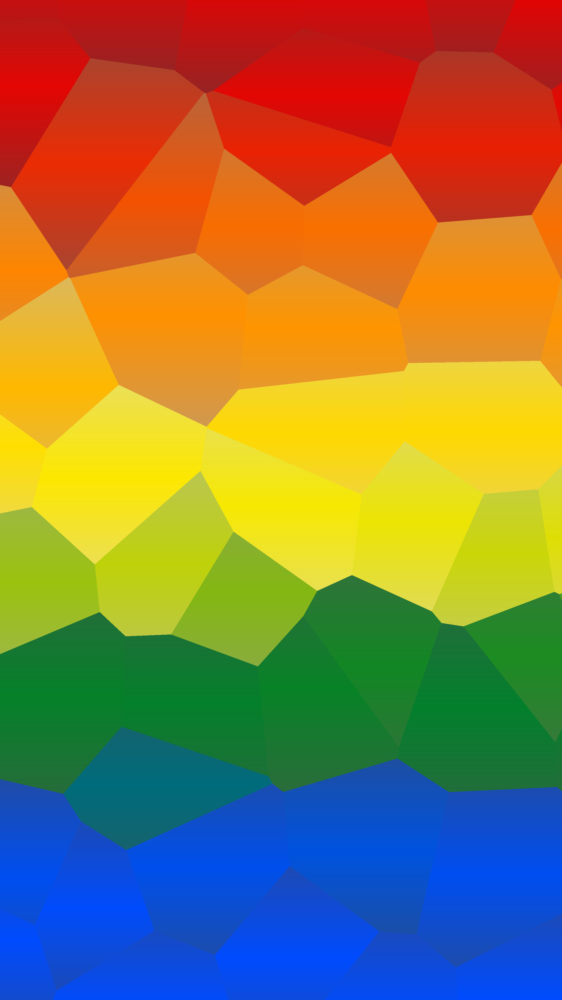

# trianglebg.py
short py script to create a background image made of triangles in a gradient of colors

## cli options
|arg|usage|example|required|
|--|--|--|--|
|`-c` or `--colors`|Colors used in the image. Hex codes seperates by commas|5BCEFA,F5A9B8,FFFFFF,F5A9B8,5BCEFA|yes|
|`-r` or `--resolution`|Resolution of the output image in  Width x Height|2304x4096|no|
|`-s` or `--size`|Average distance between the triangles centers|400|no|
|`-m` or `--color-offset`|Multiplier for the color offset|0.7|no|

## examples
`python3 trianglebg.py --resolution 2304x4096 --colors 5BCEFA,F5A9B8,FFFFFF,F5A9B8,5BCEFA`

`python3 trianglebg.py --resolution 2304x4096 --colors E40303,FF8C00,FFED00,008026,004CFF --color-offset 0.7`
